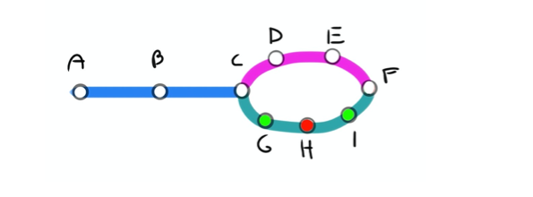

# Subway Shortest Path

### Buda's Software Engineer Homework Assignment 

<br/><br/>
## Approach

I modeled the subway as a tree structure where the stations are connected nodes of this tree. To find one of the shortest paths I implemented the **Bidirectional Breadth-First Search** algorithm. It is similar to BFS but starts from both nodes until an intersection is found and it has better performance.  

<br/><br/>
## Input File

To use the program with your own network, you will need to add a JSON file. The structure of this file is an array of arrays, where each nested array represents a subway line, and inside them the objects with the station information, the name is required but the color is not. The order of the stations is important, that's the way the program knows how to connect them.
<br/><br/>

From the assignment example:
<br/><br/>


<br/><br/>
```
[
  [
    { "name": "A" },
    { "name": "B" },
    { "name": "C" }
  ],
  [
    { "name": "C" },
    { "name": "D" },
    { "name": "E" },
    { "name": "F" }
  ],
  [
    { "name": "C" },
    { "name": "G" , "color": "V" },
    { "name": "H", "color": "R" },
    { "name": "T", "color": "V" },
    { "name": "F"}
  ],
  [
    { "name": "C" },
    { "name": "D" },
    { "name": "E" },
    { "name": "F"}
  ]
]
```
<br/><br/>
## Setup


Assuming you have node installed. Clone the repository and add node packages.

>```yarn```

<br/><br/>
## Run Program


In the root directory, run in your terminal:

>```node main.js input_file.json start_node end_node train_color(optional)```


For the next example
> ```node main.js test_files/given_example.json A F R ```

The terminal should print
> ``` The shortest path is A,B,C,H,F Total Distance: 4```

<br/><br/>

## Tests

Tests are mainly different scenarios of the example that was given. These were conducted using ```Jest```.

To run tests in you terminal:

>```yarn test```

